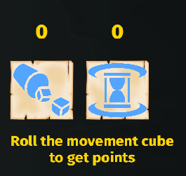
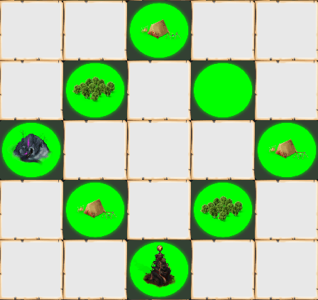
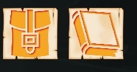
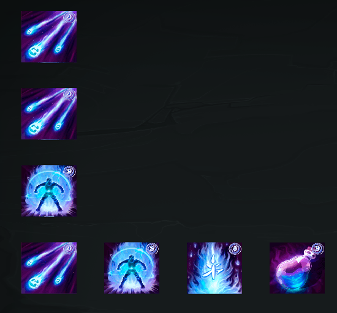
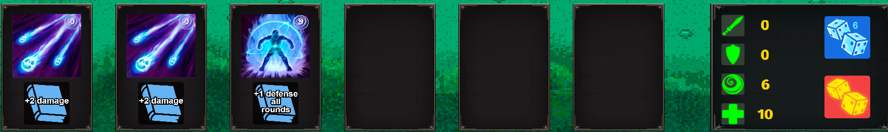
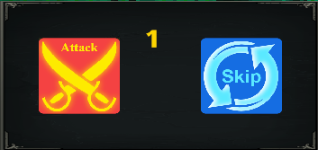

# Warlock adventures

Project created with [Bevy](https://bevyengine.org/) = "0.7.0"

A small step-by-step strategy
 * rotate the camera with WASD or the cursor at the edge of the map
 * roll a stepping die to get movement points and move on to the next turn

 * visit the interactive places on the map to get equipment, new abilities and engage in battle

 * don't forget to upgrade your gear after you get a new item

* join the battles
* use the mana cube to apply the ability

* use the attack button to deal final damage or skip your turn to get mana points in the next round

## Run application
    cargo run --release

